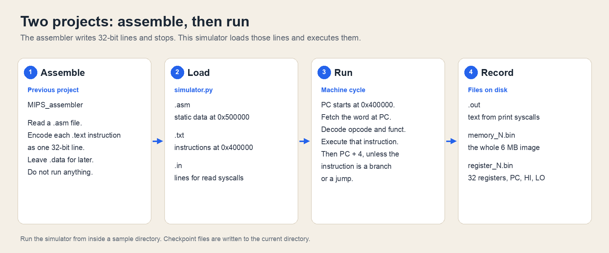
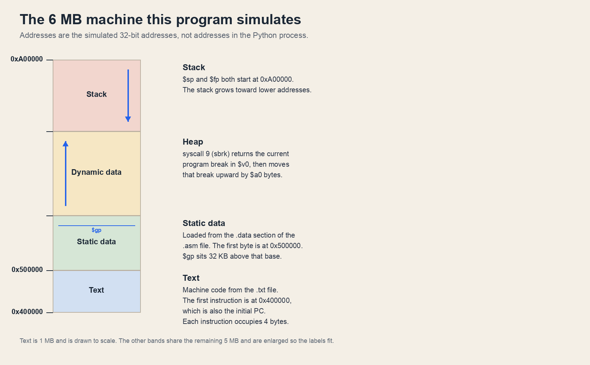
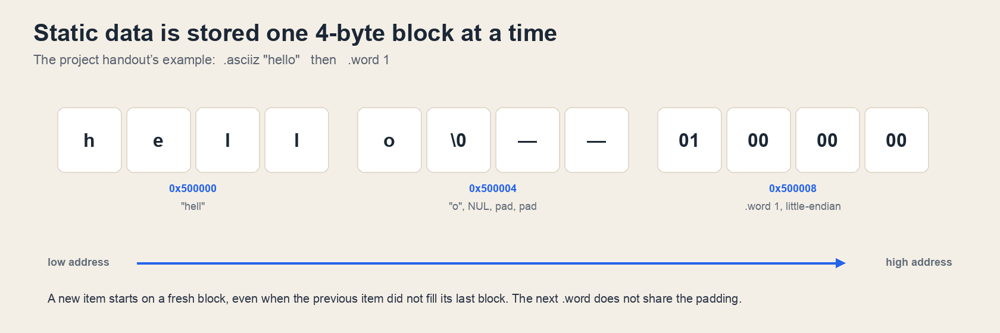
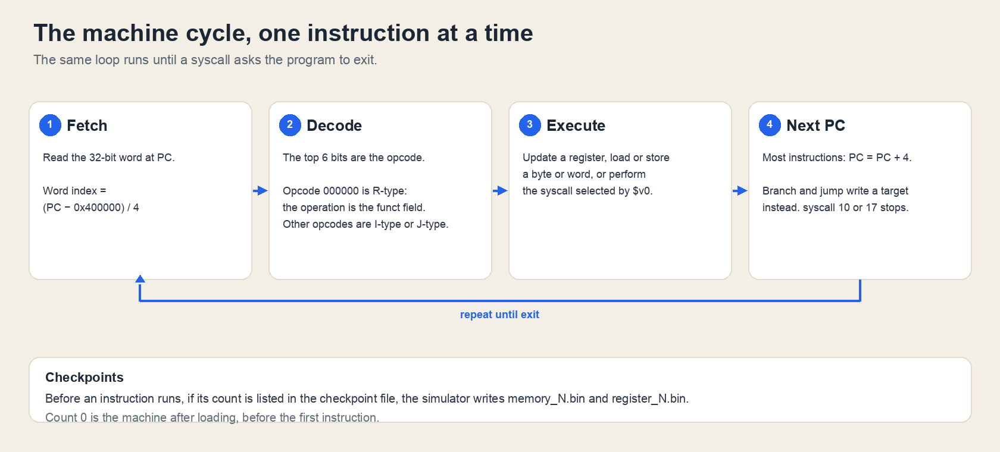

# MIPS Simulator

Course project for **CSC3050: Computer Architecture** at The Chinese University of Hong Kong, Shenzhen.

This repository is the sequel to the [MIPS assembler](https://github.com/yangbright-2001/MIPS_assembler), the first project in the same course. The assembler reads a `.asm` file and writes one 32-bit line of machine code per instruction. It stops there. This program takes that machine code and runs it: it simulates the memory, the registers, and the machine cycle of a small MIPS processor, including the system calls a program uses to read and print.

The simulator is `simulator.py`. It uses only the Python 3 standard library.

## 1. Overall workflow



One run is five files. The `.txt` file is the program. The `.asm` file is read again only so the simulator can load the `.data` section into the static data segment. Labels in `.data` are ignored, and `.text` in the `.asm` file is not assembled a second time.

| Argument | Example | Role |
| --- | --- | --- |
| `test.asm` | [`a-plus-b/a-plus-b.asm`](a-plus-b/a-plus-b.asm) | Assembly source. Static data is placed at `0x500000`. |
| `test.txt` | [`a-plus-b/a-plus-b.txt`](a-plus-b/a-plus-b.txt) | Machine code, one 32-bit line per instruction, loaded at `0x400000`. |
| `test_checkpts.txt` | [`a-plus-b/a-plus-b_checkpts.txt`](a-plus-b/a-plus-b_checkpts.txt) | Instruction counts at which memory and registers are snapshotted. |
| `test.in` | [`a-plus-b/a-plus-b.in`](a-plus-b/a-plus-b.in) | Lines consumed by `read_int`, `read_char`, and `read_string`. |
| `test.out` | [`a-plus-b/a-plus-b.out`](a-plus-b/a-plus-b.out) | File that receives everything `print_int`, `print_string`, and `print_char` write. |

The simulator then fetches, decodes, and executes instructions until a syscall exits. At each listed checkpoint it writes `memory_N.bin` (the whole 6 MB image) and `register_N.bin` (32 general-purpose registers, then PC, HI, and LO).

## 2. How to run

Python 3 is enough. Run from a sample directory, so the checkpoint files land next to the reference files:

```bash
cd a-plus-b
python3 simulator.py a-plus-b.asm a-plus-b.txt a-plus-b_checkpts.txt a-plus-b.in a-plus-b.out
```

The general form, from the project handout, is:

```bash
python3 simulator.py test.asm test.txt test_checkpts.txt test.in test.out
```

Each sample directory contains its own copy of `simulator.py`. The file at the repository root is the same program. The terminal also prints a register trace after every instruction. The output the assignment grades is the `.out` file. To keep the terminal quiet:

```bash
python3 simulator.py a-plus-b.asm a-plus-b.txt a-plus-b_checkpts.txt a-plus-b.in a-plus-b.out >/dev/null
```

Compare a run with the reference files in the same directory:

```bash
cmp a-plus-b.out a-plus-b_correct.out
cmp memory_0.bin memory_correct_0.bin
cmp register_0.bin register_correct_0.bin
```

`cmp` prints nothing when the two files are identical. Compare against `*_correct.out`, `memory_correct_*.bin`, and `register_correct_*.bin`. A fresh run of each sample in this repository matches those references. A plain `*.out` file, where one is checked in, is an earlier saved run.

`requirements.yml` is the Conda environment used when the project was written (Python 3.9.15). The simulator does not import anything from it.

## 3. Repository layout

```text
simulator.py                 the program; copies also sit in each sample directory
a-plus-b/                    read two integers, print the sum
fib/                         recursive Fibonacci
lw_sw/                       lw / sw of a static word
many/                        strings, characters, halfwords, bytes, file I/O
memcpy-hello-world/          sbrk, memcpy, print
Assignment_2_120090874.pdf   project report
docs/                        figures in this README
```

Inside a sample directory, `*_correct.out`, `memory_correct_*.bin`, and `register_correct_*.bin` are the reference results. `memory_*.bin` and `register_*.bin` are snapshots from a run. The `.bin` files are raw little-endian memory images; compare them with `cmp` rather than opening them as text.

## 4. Background Knowledge

A processor does not read `add $t0, $t1, $t2`. It reads a 32-bit word from the address in the program counter (PC), decodes the fields in that word, does the operation, and then moves on. This program does that inside a Python process. The addresses below belong to the simulated machine. `0x400000` is the first byte of simulated text, stored at index 0 of a Python list.

### 4.1 Memory and registers



The block starts at `0x400000` and is 6 MB long, so it ends at `0xA00000`.

| Region | Address | What is stored there |
| --- | --- | --- |
| Text | `0x400000` – `0x4FFFFF` (1 MB) | One instruction per word, taken from the `.txt` file. The PC starts at `0x400000`. |
| Static data | from `0x500000` | The `.data` section: `.ascii`, `.asciiz`, `.word`, `.half`, `.byte`. |
| Dynamic data | from the program break upward | Bytes handed out by `sbrk` (syscall 9). |
| Stack | from `0xA00000` downward | Saved registers and return addresses. `$sp` and `$fp` both start at `0xA00000`. |

`$gp` starts at `0x508000`, 32 KB past the start of static data, so a 16-bit signed offset from `$gp` can reach the first 64 KB of that segment.

Memory is a list of `6 * 2^18` integers, one 32-bit word each. The word at simulated address `A` lives at index `(A - 0x400000) / 4`. Registers are a second list of 35 words: `$zero` through `$ra` (numbers 0 through 31), then PC, HI, and LO.

| Register | Number in the list | Initial value |
| --- | --- | --- |
| `$zero` … `$ra` | 0 … 31 | 0, except `$gp`, `$sp`, `$fp` |
| `$gp` | 28 | `0x508000` |
| `$sp` | 29 | `0xA00000` |
| `$fp` | 30 | `0xA00000` |
| PC | 32 | `0x400000` |
| HI, LO | 33, 34 | 0 |

HI and LO hold the remainder and quotient of `div` / `mult`.

Each data item is given whole 4-byte blocks. If an item ends in the middle of a block, the rest of that block is padding, and the next item starts at the next block.



Characters of `.ascii` and `.asciiz` occupy successive bytes from the low address, in the order they are written. `.asciiz` adds a NUL byte. `.word`, `.half`, and `.byte` are little-endian, so the word `1` is the four bytes `01 00 00 00`. Checkpoint files are dumped the same way: each word is written little-endian, low address first.

### 4.2 Machine cycle



The loop follows the project handout:

1. Fetch the 32-bit word at PC.
2. Decode it. Opcode `000000` is R-type and the operation is the funct field. The other opcodes are I-type or J-type.
3. Execute it: update a register, load or store, or perform the syscall selected by `$v0`.
4. Most instructions then set PC to PC + 4. A branch or jump writes the target instead. Syscall 10 or 17 stops the loop.

Before each instruction, if the number of instructions already completed is listed in the checkpoint file, the simulator writes the two `.bin` files. Count `0` is the machine after loading and before the first instruction. `memory_N.bin` is 6 MB. `register_N.bin` is 35 words, 140 bytes.

### 4.3 Instructions and system calls

The simulator executes the instruction set assembled by the [previous project](https://github.com/yangbright-2001/MIPS_assembler). Pseudo-instructions and coprocessor instructions are not required.

R-type: `add` `addu` `and` `div` `divu` `jalr` `jr` `mfhi` `mflo` `mthi` `mtlo` `mult` `multu` `nor` `or` `sll` `sllv` `slt` `sltu` `sra` `srav` `srl` `srlv` `sub` `subu` `syscall` `xor`

I-type: `addi` `addiu` `andi` `beq` `bgez` `bgtz` `blez` `bltz` `bne` `lb` `lbu` `lh` `lhu` `lui` `lw` `lwl` `lwr` `ori` `sb` `sh` `slti` `sltiu` `sw` `swl` `swr` `xori`

J-type: `j` `jal`

`add` does not trap on overflow. `div`, `divu`, `mult`, and `multu` are only required for non-negative operands. Data directives contain only integers.

Every syscall has the same encoding, `00000000000000000000000000001100`. `$v0` selects the service. Reads take one line from the `.in` file. Prints append to the `.out` file and do not insert a newline.

| `$v0` | Service | Arguments | Result in this simulator |
| --- | --- | --- | --- |
| 1 | `print_int` | `$a0` = integer | decimal text appended to `.out` |
| 4 | `print_string` | `$a0` = address | bytes up to the first NUL |
| 5 | `read_int` | | next `.in` line parsed into `$v0` |
| 8 | `read_string` | `$a0` = buffer, `$a1` = length | next `.in` line written into memory |
| 9 | `sbrk` | `$a0` = number of bytes | old program break returned in `$v0`; the break then moves up |
| 10 | `exit` | | simulation stops |
| 11 | `print_char` | `$a0` = character | one byte appended to `.out` |
| 12 | `read_char` | | next `.in` line; the character is returned in `$v0` |
| 13 | `open` | `$a0` = path, `$a1` = flags, `$a2` = mode | host `open`; descriptor returned in `$a0` |
| 14 | `read` | `$a0` = descriptor, `$a1` = buffer, `$a2` = length | host `read` into memory; count returned in `$a0` |
| 15 | `write` | `$a0` = descriptor, `$a1` = buffer, `$a2` = length | host `write`; count returned in `$a0` |
| 16 | `close` | `$a0` = descriptor | host `close` |
| 17 | `exit2` | | simulation stops |

## 5. Example Tests

| Directory | What the MIPS program does | Click to open |
| --- | --- | --- |
| [`a-plus-b`](a-plus-b) | Read two integers and print their sum | [source](a-plus-b/a-plus-b.asm), [machine code](a-plus-b/a-plus-b.txt), [input](a-plus-b/a-plus-b.in), [output](a-plus-b/a-plus-b.out) |
| [`lw_sw`](lw_sw) | Load the word `13` and store it 4 bytes later | [source](lw_sw/lw_sw.asm), [machine code](lw_sw/lw_sw.txt) |
| [`fib`](fib) | Print `fib(n)` for an integer read from input | [source](fib/fib.asm), [input](fib/fib.in), [reference output](fib/fib_correct.out) |
| [`memcpy-hello-world`](memcpy-hello-world) | Allocate a buffer, copy a string into it, and print it | [source](memcpy-hello-world/memcpy-hello-world.asm), [reference output](memcpy-hello-world/memcpy-hello-world_correct.out) |
| [`many`](many) | Strings, characters, halfwords, bytes, and file I/O | [source](many/many.asm), [input](many/many.in), [reference output](many/many_correct.out) |

### 5.1 Add two integers

This is the smallest complete run. The source is [`a-plus-b/a-plus-b.asm`](a-plus-b/a-plus-b.asm):

```asm
.data
num: .word 13

.text
addi $v0, $zero, 5
syscall
add $t0, $zero, $v0
addi $v0, $zero, 5
syscall
add $t1, $zero, $v0
add $a0, $t1, $t0
addi $v0, $zero, 1
syscall

addi $v0, $zero, 10
syscall
```

The static word `13` is loaded into memory and never used. The program’s real work is the eleven instructions in `.text`. Their machine code is [`a-plus-b/a-plus-b.txt`](a-plus-b/a-plus-b.txt):

```text
00100000000000100000000000000101
00000000000000000000000000001100
00000000000000100100000000100000
00100000000000100000000000000101
00000000000000000000000000001100
00000000000000100100100000100000
00000001001010000010000000100000
00100000000000100000000000000001
00000000000000000000000000001100
00100000000000100000000000001010
00000000000000000000000000001100
```

The first line is `addi $v0, $zero, 5`:

```text
001000 00000 00010 0000000000000101
addi   $zero $v0   5
```

That writes 5 into `$v0`. The next line, `00000000000000000000000000001100`, is `syscall`. Every syscall shares that encoding, so the simulator looks at `$v0` and sees 5, which reads an integer.

The input file [`a-plus-b/a-plus-b.in`](a-plus-b/a-plus-b.in) has one integer per line:

```text
-203
102
```

Walking the instructions:

1. `addi $v0, $zero, 5`, then `syscall` reads `-203` into `$v0`. `add $t0, $zero, $v0` keeps it in `$t0`.
2. The same pair of instructions reads `102` into `$t1`.
3. `add $a0, $t1, $t0` computes `-203 + 102 = -101`.
4. `addi $v0, $zero, 1`, then `syscall` writes `$a0` to the output file.
5. `addi $v0, $zero, 10`, then `syscall` exits.

[`a-plus-b/a-plus-b.out`](a-plus-b/a-plus-b.out) and the reference [`a-plus-b/a-plus-b_correct.out`](a-plus-b/a-plus-b_correct.out) both contain:

```text
-101
```

[`a-plus-b/a-plus-b_checkpts.txt`](a-plus-b/a-plus-b_checkpts.txt) contains only `0`, so the run writes `memory_0.bin` and `register_0.bin` after initialization and before `addi`.

### 5.2 Load and store

[`lw_sw/lw_sw.asm`](lw_sw/lw_sw.asm) moves a word from static data into a register and back out to the next word:

```asm
.data
num: .word 13

.text
lui $t2, 80 # these lines give demo on how lw/lb/lh and sw/sb/sh works
ori $s0, $t2, 0
add $s1, $s0, $zero
lw $s0, 0($s0)
sw $s0, 4($s1)

addi $v0, $zero, 10
syscall
```

`lui $t2, 80` writes `80` into the upper half of `$t2`, which is the address `0x00500000`, the first byte of static data. `lw` reads the word `13` from that address. `sw` writes `13` to `0x00500004`. There is no print syscall, and [`lw_sw/lw_sw.in`](lw_sw/lw_sw.in) is empty, so the `.out` file is empty too.

The machine code is [`lw_sw/lw_sw.txt`](lw_sw/lw_sw.txt):

```text
00111100000010100000000001010000
00110101010100000000000000000000
00000010000000001000100000100000
10001110000100000000000000000000
10101110001100000000000000000100
00100000000000100000000000001010
00000000000000000000000000001100
```

[`lw_sw/lw_sw_checkpts.txt`](lw_sw/lw_sw_checkpts.txt) asks for snapshots after instruction 4 (`lw`, so `$s0` holds 13) and instruction 5 (`sw`, so the next memory word holds 13):

```text
4
5
```

### 5.3 Fibonacci

[`fib/fib.asm`](fib/fib.asm) reads `n` and prints `fib(n)`. The strings live in `.data`. `lui` / `ori` build their addresses the same way as in the load/store sample: data starts at `0x500000`, so `lui $at, 80` followed by `ori $a0, $at, 0` is the address of `FIB_START`.

```asm
.data
FIB_START: .asciiz "fib("
FIB_MID: .asciiz ") = "
LINE_END: .asciiz "\n"
.text
addi $v0, $zero, 5
syscall
add $s1, $zero, $v0
lui $at, 80
ori $a0, $at, 0
addi $v0, $zero, 4
syscall
addu $a0, $s1, $zero
addi $v0, $zero, 1
syscall
# ... print ") = ", call fibonacci, print the result, exit
```

The recursive routine saves `$ra`, `$s0`, and `$s1` on the stack, calls itself for `n - 1` and `n - 2`, then restores the stack and returns with `jr $ra`. The full routine is in [`fib/fib.asm`](fib/fib.asm). The corresponding machine code is [`fib/fib.txt`](fib/fib.txt).

[`fib/fib.in`](fib/fib.in) is a single line:

```text
10
```

The reference output [`fib/fib_correct.out`](fib/fib_correct.out) is:

```text
fib(10) = 55
```

The newline comes from the string `LINE_END`. [`fib/fib_checkpts.txt`](fib/fib_checkpts.txt) lists:

```text
0
3
7
```

Count 3 is just after `add $s1, $zero, $v0`, so `$s1` holds the input 10 and nothing has been printed. Count 7 is just after the first `print_string`, so the output so far is the four characters `fib(`. The run also writes `memory_0.bin`, `memory_3.bin`, `memory_7.bin`, and the matching `register_*.bin` files. The reference copies are `memory_correct_0.bin` and so on, in the same directory.

### 5.4 Hello, world by copying bytes

[`memcpy-hello-world/memcpy-hello-world.asm`](memcpy-hello-world/memcpy-hello-world.asm) stores a string and its length, asks `sbrk` for a 16-byte buffer, copies the string in with a small `memcpy`, and prints the copy:

```asm
.data
HELLO: .ascii "hello, world\n"
LENGTH: .word 13
.text
	lui $at, 80
	ori $s0, $at, 16
	lw $s0, 0($s0)
	lui $at, 80
	ori $s3, $at, 0
	addi $v0, $zero, 9
	addi $a0, $zero, 16
	syscall
	# $v0 is the new buffer; copy LENGTH bytes from HELLO, then print_string
```

`HELLO` is `.ascii`, so it has no trailing NUL. The copy is 13 bytes, which is `hello, world` plus a newline. The heap returned by `sbrk` starts out zero-filled, so the byte after the copy is a NUL and `print_string` stops there. The input file is empty. [`memcpy-hello-world/memcpy-hello-world_correct.out`](memcpy-hello-world/memcpy-hello-world_correct.out) is:

```text
hello, world
```

[`memcpy-hello-world/memcpy-hello-world_checkpts.txt`](memcpy-hello-world/memcpy-hello-world_checkpts.txt) asks for snapshots after instructions 12, 13, 21, and 55. Instruction 12 finishes setting the copy length. Instruction 13 is the `jal __builtin_memcpy`, so the next snapshot is taken with `$ra` already pointing at the instruction after the call.

### 5.5 The mixed test

[`many/many.asm`](many/many.asm) is the long sample. Its `.data` section is a tour of the directives the simulator has to place in memory:

```asm
.data
str1: .asciiz "Testing lb,sb,read/print_char, etc\n"
str2: .asciiz "Please enter a char:\n"
str5: .ascii "aaa\n"
str6: .ascii "bbbbbbb\n"
half: .half 1,2
byte: .byte 1,2,3,4
```

The `.text` section then prints those strings, reads a character, reads a string, allocates memory with `sbrk`, and opens `/tmp/file.txt`. Near the end it loads the two halves, shifts the first into the upper 16 bits, ORs in the second, and adds 1, which prints `65539`. It packs the four bytes the same way, most significant byte first, then subtracts 1, which prints `16909059`.

[`many/many.in`](many/many.in) supplies the character and the string, one line each:

```text
$
. If you see this, your read_string is fine :)
```

The reference output [`many/many_correct.out`](many/many_correct.out) is:

```text
Testing lb,sb,read/print_char, etc
Please enter a char:
The char you entered is:$
Tests for .ascii
aaa
bbbbbbb
ccc
bbbbbbb
ccc
ccc
You should see:
aaa
bbbbbbb
ccc
bbbbbbb
ccc
ccc
for those strings
Testing for fileIO syscalls
num of chars printed to file:41
If you see this, your fileIOs are cool!
Testing for .half,.byte
For half, the output should be: 65539 in decimal, and you have:65539
For byte, the output should be: 16909059 in decimal, and you have:16909059. If you see this, your read_string is fine :)
Bye!:D
```

File syscalls in this sample (`open`, `read`, `write`, `close`) call the host operating system. The file descriptor and the byte count come back in `$a0`, which is what `many.asm` reads.
